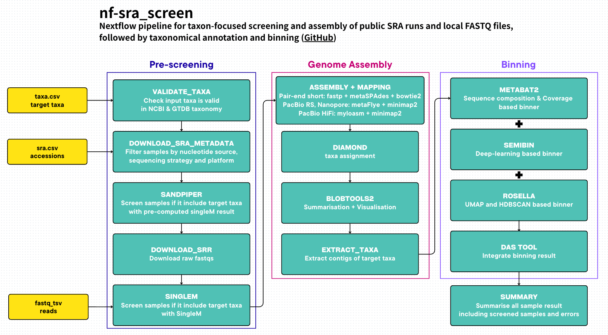

# nf-sra_screen

[](https://www.nextflow.io/)
[](https://www.docker.com/)
[](https://sylabs.io/docs/)
<!-- [](https://docs.conda.io/en/latest/) -->


## Table of contents

- [Introduction](#introduction)
- [Installation](#installation)
- [Inputs](#inputs)
- [Usage](#usage)
- [Output Structure](#output-structure)
- [Managing storage with watch_and_transfer.sh](#managing-storage-with-watch_and_transfersh)
- [Example SLURM wrapper: run.sh](#example-slurm-wrapper-runsh)


## Introduction

**nf-sra_screen** is a Nextflow pipeline for taxon‑focused screening and assembly of public SRA runs and/or local FASTQ files, followed by taxonomic annotation and (optionally) binning.



Given:
- a list of SRA accessions and/or a table of local FASTQ files,
- a NCBI taxonomy snapshot and NCBI <-> GTDB mapping tables,
- a UniProt DIAMOND database
- (Optional) Sandpiper and SingleM marker‑gene databases for pre-screening,

the pipeline will:
1. Discover and filter suitable SRR runs from SRA metadata (short‑read, ONT, PacBio CLR/HiFi).
2. (Optional, with `--taxa`) Pre‑screen samples using Sandpiper and/or SingleM against a GTDB‑derived phylum list.
3. (Assembly mode; default) Assemble reads with:
   - **metaSPAdes** for short reads
   - **metaFlye** for ONT and PacBio CLR
   - **myloasm** for PacBio HiFi
4. (Assembly mode) Annotate contigs with DIAMOND against UniProt and summarise with BlobToolKit.
5. (Optional, with `--taxa`) Extract contigs matching user‑specified taxa into per‑taxon FASTA and ID lists.
6. (Optional, with `--binning`) Run multiple metagenome binners (MetaBAT2, SemiBin, Rosella) and reconcile them with DAS Tool.
7. Collate a per‑sample `summary.tsv` with counts and failure/success notes, and post‑annotate it using scheduler info from the Nextflow `trace.tsv`.

### Pipeline modes
The pipeline has four phases:
- `PRE_SCREENING` – SRA metadata -> SRR selection -> optional Sandpiper/SingleM screening.
- `ASSEMBLY` – Assembly, DIAMOND, BlobToolKit, optional taxon extraction.
- `BINNING` – MetaBAT2, SemiBin, Rosella, DAS Tool, and binning note aggregation.
- `SUMMARY` – merges all success and failure notes into the final global `summary.tsv`.

You can run it in the following modes:

| Mode | What runs | Key flags | Typical use |
| ---- | ----------| --------- | ----------- |
| **Screening only** | PRE_SCREENING + SUMMARY | `--noassembly` (often with `--taxa`) | Quickly triage many SRR/sample inputs before committing to assembly |
| **Assembly only** | PRE_SCREENING + ASSEMBLY + SUMMARY | *(default)* | Assemblies + BlobToolKit summaries, no binning |
| **Assembly + binning** | PRE_SCREENING + ASSEMBLY + BINNING + SUMMARY | `--binning` | Assemblies + multi‑binner bins + DAS Tool |
| **Taxon screening + extraction** | Adds Sandpiper/SingleM (and extraction in assembly mode) | `--taxa` | Focus on a taxon list; optionally extract contigs |
| **Taxon screening + extraction + binning** | As above + binning | `--taxa --binning` | Full run |

> [!NOTE]
> - `--binning` is only meaningful when assembly is enabled (i.e. when you do not set `--noassembly`). If you set both, `--binning` is ignored.
> - If you omit `--taxa`, Sandpiper/SingleM and taxon‑specific extraction are skipped.


## Installation

### Requirements

- **Nextflow**: `== 25.04.8`
- **Plugins**:
  - `nf-boost@~0.6.0` (configured in `nextflow.config`)
- **Container back‑end**:
  - Docker, or
  - Singularity / Apptainer
- For the helper watcher scripts (`watch_and_transfer.sh` / `run.sh`): a **Slurm** cluster with:
  - `sbatch`, `sacct`, `rsync`, `flock`
  - a data‑copy partition (the example uses `-p datacp`)

> [!IMPORTANT]
> This pipeline is pinned to **Nextflow `25.04.8` exactly** (newer versions are not supported due to plugin compatibility, e.g. `nf-boost`).
> Please do not use `nextflow self-update` for this project unless you have verified plugin support.


### Database requirements
All tools used by the pipeline are provided via containers defined in `nextflow.config`

- Assembly mode (default; i.e. without `--noassembly`)
  - `--taxdump`       NCBI taxdump dir (`nodes.dmp`, `names.dmp`, `taxidlineage.dmp` or classical taxdump)
  - `--uniprot_db`    UniProt DIAMOND database (`.dmnd`) (See the [BlobToolKit documentation](https://blobtoolkit.genomehubs.org/install/) for how to build this)

- Taxon screening / extraction (with `--taxa`)
  - `--taxdump`
  - `--gtdb_ncbi_map` Dir with NCBI -> GTDB crosswalk: `ncbi_vs_gtdb_bacteria.xlsx`,  `ncbi_vs_gtdb_archaea.xlsx`, `gtdb_r226.dic` from [GTDB download](https://data.gtdb.aau.ecogenomic.org/releases/release226/226.0/auxillary_files/)
  - `--singlem_db`    SingleM metapackage (e.g. `S5.4.0.GTDB_r226.metapackage_20250331.smpkg.zb`)
  - `--sandpiper_db`  (with `--sra` only) Sandpiper db with `sandpiper_sra.txt`, `sandpiper1.0.0.condensed.tsv`

> [!NOTE]
> In screening‑only mode (`--noassembly`), `--uniprot_db` is not required because DIAMOND / BlobToolKit / binners are skipped.


## Inputs

The pipeline can ingest SRA accessions and/or local FASTQ files in the same run.
Internally these are merged before assembly.

### 1. Input: SRA samplesheet (`--sra`)

Prepare a CSV with a single column `sra`, each row representing an SRA project (or study‑level) accession:

`sra.csv`
```csv
sra
PRJNAXXXXXX
SRPXXXXXX
ERRXXXXXX
```

Each row can be a project, study, or run
The pipeline will query metadata and expand each project into multiple SRR runs internally.

The metadata files are written under:
```
<outdir>/metadata/<sra>
```

### 2. Input: FASTQ list (`--fastq_tsv`)

Prepare a TSV describing local FASTQ files.

`fastq.tsv`
```tsv
sample	read_type	reads
A98	hifi	a98.fastq.gz
B27	short	read_1.fastq.gz,read_2.fastq.gz
C03	nanopore	c03_pass.fastq.gz
D48	pacbio	d48.fastq.gz
```

- `sample`: logical sample identifier.
- `read_type`: types of reads used for assembler selection. Use descriptive labels below
    - `short`: short paired-end reads (Illumina, BGISEQ, DNBSEQ) (metaSPAdes),
    - `nanopore`: Nanopore reads (metaFlye),
    - `pacbio`: PacBio CLR reads (metaFlye),
    - `hifi`: PacBio HiFi reads (myloasm).
- `reads`: comma‑separated list of FASTQ paths (absolute or relative); at least one file per row is required. Two or more files are treated as paired‑end for SingleM/metaSPAdes, one as single‑end.


In FASTQ + screening mode (`--fastq_tsv` + `--taxa`), each sample is treated as
```txt
sra = sample
srr = sample
platform = UNKNOWN
model = read_type
strategy = UNKNOWN
assembler = read_type
```

SingleM is run in place of Sandpiper for these samples.

In FASTQ + no‑screening mode (`--fastq_tsv`), reads go straight into assembly and optionally binning.


### 3. Input: taxa list (`--taxa`)

Provide a CSV of target taxa if you want taxon‑specific screening and contig extraction:

`taxa.csv`
```csv
rank,taxa
phylum,Bacillota
class,Gammaproteobacteria
order,o__Chloroflexales
genus,g__Escherichia
```

Allowed ranks (case-insensitive)
```csv
realm,domain,superkingdom,kingdom,phylum,class,order,family,genus,species
```

> [!IMPORTANT]
> - If you do not supply `--taxa`, the pipeline skips SingleM/Sandpiper and taxon‑specific extraction.
> - If you supply the taxon in GTDB style only (e.g. `p__`, `c__`, …), the pipeline runs SingleM/Sandpiper but skips taxon‑specific extraction


## Usage
### Full example command
```bash
nextflow run asuq/nf-sra_screen \
  -profile <docker/singularity/local/slurm/...> \
  --binning \
  --sra sra.csv \
  --fastq_tsv fastq.tsv \
  --taxdump /path/to/ncbi_taxdump_dir \
  --uniprot_db /path/to/uniprot.dmnd \
  --taxa taxa.csv \
  --gtdb_ncbi_map /path/to/ncbi_vs_gtdb_xlsx_dir \
  --sandpiper_db /path/to/sandpiper_db_dir \
  --singlem_db /path/to/singlem_metapackage \
  --outdir nf-sra_screen_results
```

### Key parameters
- `-profile`         nextflow profile (see below)
- `--sra`            CSV with column `sra` listing project accessions
- `--fastq_tsv`      TSV with columns (`sample,read_type,reads`) listing sample reads
- `--taxdump`        Directory containing NCBI taxdump files; `jsonify_taxdump.py` will create `taxdump.json`
- `--uniprot_db`     UniProt DIAMOND database (`.dmnd`) (Follow [blobtools tutorial](https://blobtoolkit.genomehubs.org/install/))
- `--taxa`           (Optional) CSV with rank,taxa (NCBI or GTDB names). Use it if you want taxonomy screening
- `--gtdb_ncbi_map`  (Required with `--taxa`) Directory with ncbi_vs_gtdb_bacteria.xlsx and ncbi_vs_gtdb_archaea.xlsx. For taxonomy screening
- `--sandpiper_db`   (Required with `--taxa` and `--sra`) Directory with Sandpiper summary tables. For taxonomy screening
- `--singlem_db`     (Required with `--taxa`) SingleM metapackage (e.g. S5.4.0.GTDB_r226.metapackage_20250331.smpkg.zb) For taxonomy screening
- `--binning`        (Optional) Run BINNING after ASSEMBLY (MetaBAT2 + SemiBin + Rosella + DAS Tool)
- `--noassembly`     (Optional) Skip ASSEMBLY and BINNING; run PRE_SCREENING + SUMMARY only. If set, `--binning` is ignored
- `--outdir`         Output directory (default: ./output)
- `--max_retries`    Maximum number of retries per process (default: 3)
- `--help`           Print the pipeline help message and exit.

### Profiles
- `local`
  - Executor: `local`
  - `docker.enabled = true`
  - Small queue size and moderate resources (max_cpus=8, max_memory=16.GB).
- `slurm`
  - Executor: `slurm`
  - `singularity.enabled = true`
  - Large queue size (`queueSize=2000`) and increased resource caps.
- `oist`
  - Includes `conf/oist.config` for OIST Deigo HPC settings.
- `debug`
  - docker.enabled = true
  - `executor.queueSize = 1`
  - Extended trace.fields for debugging.
- `test`
  - For small regression tests.


<details>
<summary><strong>Output structure</strong></summary>

## Output structure
```txt
<output>/
  metadata/
    <sra>/
      <sra>.filtered.csv
      <sra>.skipped.csv
      <sra>.FAIL.note              # if metadata step failed

  <sra>/<srr>/
    # Screening
    singlem_taxonomic_profile.tsv
    singlem_taxonomic_profile_krona*
    singlem_output.tsv

    # Screening (only with --sra)
    sandpiper_report.txt
    sandpiper_output.tsv
    sandpiper_decision.txt

    # Assembly
    assembly.fasta
    assembly.gfa
    spades.log / flye.log / myloasm.log
    fastp.html                     # short-read only

    # BlobToolKit
    blobtools.csv
    blobtools*.svg

    # Taxon extraction (if --taxa and not --noassembly)
    summary.csv
    *.ids.csv
    *.fasta

    # Binning (if --binning)
    binning/
      metabat/
      semibin/
      rosella/
      dastool/
      metabat.note                 # if failed
      semibin.note                 # if failed
      rosella.note                 # if failed
      dastool.note                 # if failed

  summary.tsv                      # global summary across all samples

execution-reports/
  timeline.html
  report.html
  trace.tsv
```

> [!NOTE]
> In `--noassembly` mode, summary.tsv is still produced, but assembly/BlobToolKit/extraction/binning outputs are not.

</details>

<details>
<summary><strong>Managing storage with watch_and_transfer.sh</strong></summary>

## Managing storage with `watch_and_transfer.sh`

Long metagenomic runs can fill storage rapidly. The helper script `watch_and_transfer.sh` is designed to stream finished per‑sample output folders off the run directory to a longer‑term storage location and clean up safely.

### Requirements

- Slurm environment with:
  - `sbatch`
  - `sacct`
  - a partition suitable for data transfer (the script uses `-p datacp`; change if needed)

The pipeline must be writing summary.tsv to `RUN_DIR/output/summary.tsv`, which is the default when `--outdir` output and you run from `RUN_DIR`.

### What it does

Given:

- `RUN_DIR`: the Nextflow run directory (where output/ and summary.tsv live)
- `DEST_DIR`: a larger storage area (e.g. object store or shared filesystem)
- `INTERVAL_MINS`: how often to scan for new samples

`watch_and_transfer.sh` will:
1. Acquire an exclusive lock in `RUN_DIR/.watch_and_transfer.lock` so only one watcher instance runs per pipeline.

2. Read `RUN_DIR/output/summary.tsv` and, for each `(sra,srr)`:
    - Skip samples already listed in `RUN_DIR/.processed_summary.tsv`.
    - Skip samples that already have a pending transfer in `RUN_DIR/.pending_copy_jobs.tsv`.

3. Interpret the note column:
    - If `note` starts with
      - `did not match the criteria`:
      the run was filtered at the metadata stage; it is recorded as processed without any transfer.

    - If `note` is non‑empty and `output/$sra/$srr` does not exist, the run is considered failed/filtered with no outputs and is marked processed.

    - Otherwise, the run is treated as a completed sample with outputs.

4. For each completed sample with an output directory:
    - Submits a Slurm job via sbatch on partition datacp:
      `rsync -a "${RUN_DIR}/output/$sra/$srr"/ "${DEST_DIR}/$sra/$srr"/`

    - followed by: `rm -rf ${RUN_DIR}/output/$sra/$srr`

    - Attempt to rmdir the now‑empty `${RUN_DIR}/output/$sra directory`.

Records (sra,srr,job_id) in .pending_copy_jobs.tsv.

5. On each cycle, `check_pending_jobs`:
    - Queries Slurm with `sacct` for all pending job IDs.
    - For jobs that finished with `State=COMPLETED` and ExitCode starting with 0, logs success.
    - Deletes the corresponding `slurm-<jobid>.out` log.
    - Appends `(sra,srr)` to `.processed_summary.tsv`.
    - For jobs in transient states (PENDING/RUNNING/etc.), keeps them pending.
    - For failed/cancelled/time‑out jobs, removes them from pending; the sample will be re‑submitted in a later cycle.

The script runs indefinitely in a loop:
```bash
while :; do
  check_pending_jobs
  move_output_to_storage
  sleep "$INTERVAL_MINS" minutes
done
```

### Basic usage

From a login node (ideally in a tmux/screen session):

```bash
bin/watch_and_transfer.sh RUN_DIR DEST_DIR INTERVAL_MINS
```

Example:
```bash
bin/watch_and_transfer.sh \
  /fast/youruser/project_X/run1 \
  /long/yourgroup/project_X/archive \
  10
```

This will:

- Check every 10 minutes for new rows in `output/summary.tsv`.
- Start Slurm copy jobs as samples finish.
- Free space under `RUN_DIR/output` once a copy is verified as successful.
- Keep a small amount of state in:
  - `RUN_DIR/.processed_summary.tsv`
  - `RUN_DIR/.pending_copy_jobs.tsv`
  - `RUN_DIR/.watch_and_transfer.lock`

</details>

<details>
<summary><strong>Example SLURM wrapper: run.sh</strong></summary>

## Example SLURM wrapper: `run.sh`

The repository includes an example wrapper `run.sh` showing how to run the pipeline and watcher together on a Slurm cluster.

What `run.sh` does
1.Defines user‑specific paths:
```bash
RUN_DIR='/fast/.../nf-sra_screen_run/outdir'
DEST_DIR='/long/.../nf-sra_screen_archive'
INTERVAL_MINS=10
NF_SRA_SCREEN='/path/to/nf-sra_screen'  # clone of this repo
```

2. Installs a `trap` so that when the script exits (successfully or not), it:
  - Attempts to stop the background watcher process cleanly.
  - Preserves the original Nextflow exit status.

3. Changes into `RUN_DIR` so that:
  - `.nextflow.log`, `work/`, and `output/` live there.
  - `watch_and_transfer.sh` can find `output/summary.tsv` at the expected location.

4. Starts the watcher in the background:
```bash
"${NF_SRA_SCREEN}/bin/watch_and_transfer.sh" \
  "${RUN_DIR}" \
  "${DEST_DIR}" \
  "${INTERVAL_MINS}" \
  > watch_and_transfer.log 2>&1 &
```
and records its PID in watch_and_transfer.pid.

5. Runs the Nextflow pipeline (with your chosen profile and parameters):

```bash
nextflow run asuq/nf-sra_screen \
  -profile <docker/singularity/local/slurm/...> \
  --sra sra.csv \
  --fastq_tsv fastq.tsv \
  --taxdump /path/to/ncbi_taxdump_dir \
  --uniprot_db /path/to/uniprot.dmnd \
  --taxa taxa.csv \
  --binning \
  --gtdb_ncbi_map /path/to/ncbi_vs_gtdb_xlsx_dir \
  --sandpiper_db /path/to/sandpiper_db_dir \
  --singlem_db /path/to/singlem_metapackage \
  --outdir nf-sra_screen_results \
  -resume
```

6. Exits with the same status code as the Nextflow run, triggering the `EXIT` trap, which in turn stops the watcher.

### Adapting `run.sh` for your cluster

To reuse this pattern:

1. Copy `run.sh` somewhere in your project.

2. Edit:
    - `RUN_DIR`: a scratch or fast filesystem path for the actual run.
    - `DEST_DIR`: slower / archival filesystem for final results.
    - `NF_SRA_SCREEN`: path to your clone of this repository.
    - The Nextflow command at the bottom (profile name, database paths, etc.).
    - The Slurm partition used for data copy in `watch_and_transfer.sh` (-p datacp) if your site uses a different name.
    - Submit `run.sh` itself as a Slurm job or run it on a login node with `tmux` (depending on your site policy). All heavy work is still done by Nextflow processes and the per‑sample transfer jobs.

</details>

## Credits

`Author / maintainer`: Akito Shima (ASUQ), akito-shima[at]oist.jp

### Core tools (via containers)
- iSeq
- SRA toolkit
- Sandpiper
- SingleM
- DIAMOND
- BlobToolKit
- fastp
- metaSPAdes / SPAdes
- Flye
- myloasm
- bowtie2
- minimap2
- samtools
- MetaBAT2
- SemiBin
- Rosella
- DAS Tool

<!-- ## Citations -->

<!-- TODO nf-core: Add citation for pipeline after first release. Uncomment lines below and update Zenodo doi and badge at the top of this file. -->
<!-- If you use ASUQ/busco_phylogenomics for your analysis, please cite it using the following doi: [10.5281/zenodo.XXXXXX](https://doi.org/10.5281/zenodo.XXXXXX) -->
