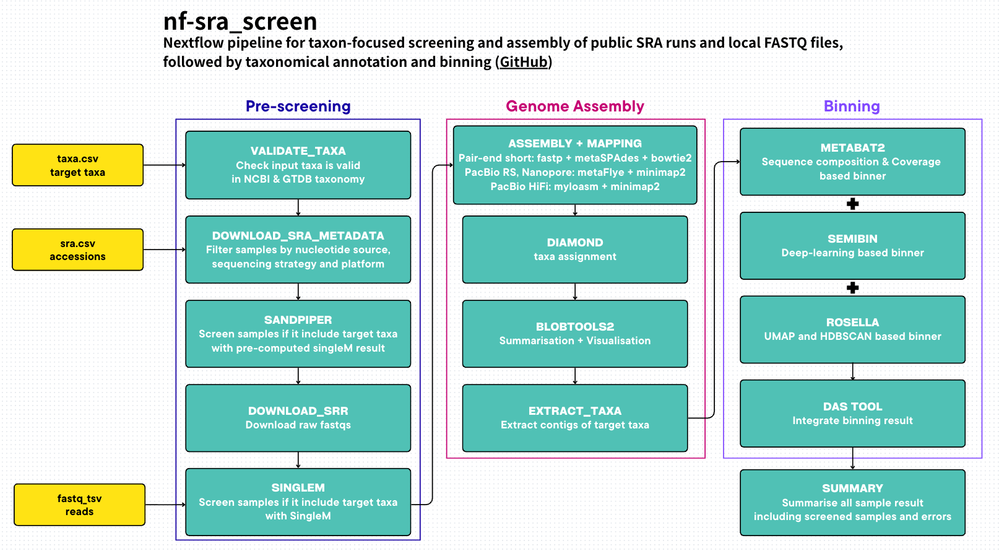

# nf-sra_screen

[](https://www.nextflow.io/)
[](https://www.docker.com/)
[](https://sylabs.io/docs/)
<!-- [](https://docs.conda.io/en/latest/) -->


## Table of contents

- [Introduction](#introduction)
- [Installation](#installation)
- [Inputs](#inputs)
- [Usage](#usage)
- [Output Structure](#output-structure)
- [Managing storage with Nextflow](#managing-storage-with-nextflow)
- [Managing GWDG 2h QOS](#managing-gwdg-2h-qos)
- [Example SLURM wrapper: run.sh](#example-slurm-wrapper-runsh)


## Introduction

**nf-sra_screen** is a Nextflow pipeline for taxon-focused screening and assembly of public SRA runs and/or local FASTQ files, followed by taxonomic annotation and optional binning.



Given:
- a list of SRA accessions and/or a table of local FASTQ files,
- a NCBI taxonomy snapshot and NCBI <-> GTDB mapping tables,
- a UniProt DIAMOND database,
- optionally, Sandpiper and SingleM marker-gene databases for pre-screening,
- optionally, a CheckM2 database when using Binette refinement.

the pipeline will:
1. Discover and filter suitable SRR runs from SRA metadata (short-read, ONT, PacBio CLR/HiFi).
2. Optionally, with `--taxa`, pre-screen samples using Sandpiper and/or SingleM against a GTDB-derived phylum list.
3. (Assembly mode; default) Assemble reads with:
   - **metaSPAdes** for short reads
   - **metaFlye** for ONT and PacBio CLR
   - **myloasm** for PacBio HiFi
   - optional multi-assembler selection with `--assemblers`
4. (Assembly mode) Annotate contigs with DIAMOND against UniProt and summarise with BlobToolKit.
5. Optionally, with `--taxa`, extract contigs matching user-specified taxa into per-taxon FASTA and ID lists.
6. Optionally, with `--binning`, run compatible metagenome binners (MetaBAT2, SemiBin, Rosella, COMEBin, VAMB, and HiFi-only LorBin) and refine them with DAS Tool and/or Binette.
7. Collate a per-sample `summary.tsv` with counts and failure/success notes, and post-annotate it using scheduler info from the Nextflow `trace.tsv`.

### Pipeline modes
The pipeline is organised into four subworkflow stages:
- `PRE_SCREENING` - SRA metadata -> SRR selection -> optional Sandpiper/SingleM screening.
- `ASSEMBLY` - Assembly, DIAMOND, BlobToolKit, optional taxon extraction.
- `BINNING` - MetaBAT2, SemiBin, Rosella, COMEBin, VAMB, HiFi-only LorBin, DAS Tool/Binette, and binning note aggregation.
- `SUMMARY` - merges all success and failure notes into the final global `summary.tsv`.

You can run it in the following modes:

| Mode | What runs | Key flags | Typical use |
| ---- | ----------| --------- | ----------- |
| **Screening only** | PRE_SCREENING + SUMMARY | `--noassembly` (often with `--taxa`) | Quickly triage many SRR/sample inputs before committing to assembly |
| **Assembly only** | PRE_SCREENING + ASSEMBLY + SUMMARY | *(default)* | Assemblies + BlobToolKit summaries, no binning |
| **Assembly + binning** | PRE_SCREENING + ASSEMBLY + BINNING + SUMMARY | `--binning` | Assemblies + compatible binners + Binette by default |
| **Taxon screening + extraction** | Adds Sandpiper/SingleM (and extraction in assembly mode) | `--taxa` | Focus on a taxon list; optionally extract contigs |
| **Taxon screening + extraction + binning** | As above + binning | `--taxa --binning` | Full run |

> [!NOTE]
> - `--binning` is only meaningful when assembly is enabled (i.e. when you do not set `--noassembly`). If you set both, `--binning` is ignored.
> - If you omit `--taxa`, Sandpiper/SingleM and taxon-specific extraction are skipped.

There is also a standalone binning entrypoint, `binning.nf`, for cases where you already have `assembly.fasta` and either the original reads or an SRR accession, and only want the mapping + binning stage.


## Installation

### Requirements

- **Nextflow**: `>= 26.04.0`
- **Container backend**:
  - Docker, or
  - Singularity / Apptainer
- For the optional GWDG QOS helper: a **Slurm** cluster with `squeue` and `scontrol`

### Database requirements
All tools used by the pipeline are provided via containers defined in `nextflow.config`.

- Assembly mode (default, without `--noassembly`)
  - `--taxdump`       NCBI taxdump dir (`nodes.dmp`, `names.dmp`, `taxidlineage.dmp` or classical taxdump)
  - `--uniprot_db`    UniProt DIAMOND database (`.dmnd`) (See the [BlobToolKit documentation](https://blobtoolkit.genomehubs.org/install/) for how to build this)

- Taxon screening / extraction (with `--taxa`)
  - `--taxdump`
  - `--gtdb_ncbi_map` Dir with NCBI -> GTDB crosswalk: `ncbi_vs_gtdb_bacteria.xlsx`,  `ncbi_vs_gtdb_archaea.xlsx`, `gtdb_r226.dic` from [GTDB download](https://data.gtdb.aau.ecogenomic.org/releases/release226/226.0/auxillary_files/)
  - `--singlem_db`    SingleM metapackage (e.g. `S5.4.0.GTDB_r226.metapackage_20250331.smpkg.zb`)
  - `--sandpiper_db`  (with `--sra` only) Sandpiper db with `sandpiper_sra.txt`, `sandpiper1.0.0.condensed.tsv`

- Binning with Binette refinement
  - `--checkm2_db`    CheckM2 database required when `--refiners` includes `binette`, including the default binning configuration

- Standalone binning (`binning.nf`)
  - `--uniprot_db`    UniProt DIAMOND database (`.dmnd`) for SemiBin2
  - `--checkm2_db`    CheckM2 database when using the default `--refiners binette`

> [!NOTE]
> In screening-only mode (`--noassembly`), `--uniprot_db` is not required because DIAMOND / BlobToolKit / binners are skipped.


## Inputs

The pipeline can ingest SRA accessions and/or local FASTQ files in the same run.
Internally these are merged before assembly.

### 1. Input: SRA samplesheet (`--sra`)

Prepare a CSV with a single column `sra`, each row representing an SRA project, study-level accession, or run accession:

`sra.csv`
```csv
sra
PRJNAXXXXXX
SRPXXXXXX
ERRXXXXXX
```

Each row can be a project, study, or run.
The pipeline will query metadata and expand each project into multiple SRR runs internally.

In SRA + screening mode (`--sra` + `--taxa`), SRA metadata is filtered first. Sandpiper then screens candidate SRR runs, and SingleM is run for downloaded reads that need marker-gene confirmation.

The metadata files are written under:
```
<outdir>/metadata/<sra>
```

### 2. Input: FASTQ list (`--fastq_tsv`)

Prepare a TSV describing local FASTQ files.

`fastq.tsv`
```tsv
sample	read_type	reads
A98	hifi	a98.fastq.gz
B27	short	read_1.fastq.gz,read_2.fastq.gz
C03	nanopore	c03_pass.fastq.gz
D48	pacbio	d48.fastq.gz
```

- `sample`: logical sample identifier.
- `read_type`: read class used for assembler selection. Use one of:
    - `short`: short paired-end reads (Illumina, BGISEQ, DNBSEQ) (metaSPAdes),
    - `nanopore`: Nanopore reads (metaFlye),
    - `pacbio`: PacBio CLR reads (metaFlye),
    - `hifi`: PacBio HiFi reads (myloasm).
- `reads`: comma-separated list of FASTQ paths (absolute or relative); at least one file per row is required. Two or more files are treated as paired-end for SingleM/metaSPAdes, one as single-end.


In FASTQ + screening mode (`--fastq_tsv` + `--taxa`), each sample is treated as
```txt
sra = sample
srr = sample
platform = UNKNOWN
model = read_type
strategy = UNKNOWN
read_type = read_type
assembler = selected assembly tool
```

FASTQ screening does not use Sandpiper. When `--taxa` is set, local FASTQ samples are sent directly to SingleM.

In FASTQ + no-screening mode (`--fastq_tsv`), reads go straight into assembly and optionally binning.


### 3. Input: taxa list (`--taxa`)

Provide a CSV of target taxa if you want taxon-specific screening and contig extraction:

`taxa.csv`
```csv
rank,taxa
phylum,Bacillota
class,Gammaproteobacteria
order,o__Chloroflexales
genus,g__Escherichia
```

Allowed ranks (case-insensitive)
```csv
realm,domain,superkingdom,kingdom,phylum,class,order,family,genus,species
```

> [!IMPORTANT]
> - If you do not supply `--taxa`, the pipeline skips SingleM/Sandpiper and taxon-specific extraction.
> - If you supply the taxon in GTDB style only (for example `p__` or `c__`), the pipeline runs SingleM/Sandpiper but skips taxon-specific extraction.


### 4. Input: standalone binning sheet (`binning.nf --binning_tsv`)

Use `binning.nf` when you already have an assembly and want to run mapping + binning without re-running `main.nf`.

`binning.tsv`
```tsv
sample	read_type	reads	srr	assembly_fasta
A98	hifi	a98.fastq.gz		/path/to/A98/assembly.fasta
B27	short	read_1.fastq.gz,read_2.fastq.gz		/path/to/B27/assembly.fasta
C03			SRR12345678	/path/to/C03/assembly.fasta
```

- `sample`: logical sample identifier. Internally, `sra = sample`.
- `read_type`: required for local-read rows; must be one of `short`, `nanopore`, `pacbio`, or `hifi`.
- `reads`: comma-separated FASTQ paths for local-read rows.
  - `short` accepts one FASTQ (single-end) or two FASTQs (paired-end).
  - `nanopore`, `pacbio`, and `hifi` accept one or more FASTQs.
- `srr`: optional SRR accession for download-backed rows. If set, raw reads are downloaded automatically and `read_type` is ignored.
- `assembly_fasta`: path to the assembly to bin against.
- Provide exactly one of `reads` or `srr` in each row.

`binning.nf` skips screening, DIAMOND, BlobToolKit, and taxon extraction. It maps either the supplied local reads or downloaded SRR FASTQs back to `assembly_fasta`, then runs the selected compatible binners (MetaBAT2, SemiBin2, Rosella, COMEBin, VAMB, and HiFi-only LorBin), selected refiners (DAS Tool and/or Binette), and writes a minimal `summary.tsv`.


## Usage
### Full example command
```bash
nextflow run asuq/nf-sra_screen \
  -profile <docker/singularity/local/slurm/...> \
  --binning \
  --assemblers auto \
  --sra sra.csv \
  --fastq_tsv fastq.tsv \
  --taxdump /path/to/ncbi_taxdump_dir \
  --uniprot_db /path/to/uniprot.dmnd \
  --taxa taxa.csv \
  --gtdb_ncbi_map /path/to/ncbi_vs_gtdb_xlsx_dir \
  --sandpiper_db /path/to/sandpiper_db_dir \
  --singlem_db /path/to/singlem_metapackage \
  --checkm2_db /path/to/checkm2_db \
  --outdir nf-sra_screen_results
```

### Standalone binning example
```bash
nextflow run binning.nf \
  -profile <docker/singularity/local/slurm/...> \
  --binning_tsv binning.tsv \
  --uniprot_db /path/to/uniprot.dmnd \
  --checkm2_db /path/to/checkm2_db \
  --outdir nf-sra_screen_binning
```

### Key parameters
- `-profile`         nextflow profile (see below)
- `--sra`            CSV with column `sra` listing project accessions
- `--fastq_tsv`      TSV with columns (`sample,read_type,reads`) listing sample reads
- `--binning_tsv`    TSV for standalone `binning.nf`, using either local-read rows (`sample,read_type,reads,assembly_fasta`) or SRR rows (`sample,srr,assembly_fasta`)
- `--taxdump`        Directory containing NCBI taxdump files; `jsonify_taxdump.py` will create `taxdump.json`
- `--uniprot_db`     UniProt DIAMOND database (`.dmnd`) (Follow [blobtools tutorial](https://blobtoolkit.genomehubs.org/install/))
- `--taxa`           (Optional) CSV with rank,taxa (NCBI or GTDB names). Use it if you want taxonomy screening
- `--assemblers`     (Optional) Assembly tools: `auto`, `all`, or comma-separated names. Default `auto` uses `metaspades` for short reads, `metaflye` for Nanopore/PacBio CLR, and `myloasm` for HiFi. Supported tools are `metaspades`, `unicycler`, `metaflye`, and `myloasm`; aliases `spades` and `flye` are accepted.
- `--assembler`      Alias for `--assemblers`.
- `--gtdb_ncbi_map`  (Required with `--taxa`) Directory with ncbi_vs_gtdb_bacteria.xlsx and ncbi_vs_gtdb_archaea.xlsx for taxonomy screening
- `--sandpiper_db`   (Required with `--taxa` and `--sra`) Directory with Sandpiper summary tables for SRA taxonomy screening
- `--singlem_db`     (Required with `--taxa`) SingleM metapackage (e.g. S5.4.0.GTDB_r226.metapackage_20250331.smpkg.zb) for taxonomy screening
- `--binning`        (Optional) Run BINNING after ASSEMBLY (all read-type-compatible binners + Binette by default)
- `--binners`        Comma-separated binners (default: `all-compatible`; allowed: `all-compatible,auto,metabat,semibin,rosella,comebin,vamb,lorbin`). `all-compatible` runs all read-type-compatible binners; `auto` is accepted as a compatibility alias. LorBin runs only for HiFi reads.
- `--refiners`       Comma-separated refiners (default: `binette`; allowed: `dastool,binette`)
- `--checkm2_db`     CheckM2 database required when `--refiners` includes `binette`; required for default binning because `binette` is the default refiner
- `--semibin_environment` SemiBin2 pretrained environment (default: `global`)
- `--gpu`            Bare flag enabling GPU variants for COMEBin, VAMB, and HiFi-only LorBin; MetaBAT2, SemiBin, and Rosella stay CPU-only
- `--noassembly`     (Optional) Skip ASSEMBLY and BINNING; run PRE_SCREENING + SUMMARY only. If set, `--binning` is ignored
- `--outdir`         Output directory (default: ./output)
- `--max_retries`    Maximum number of retries per process (default: 3)
- `--queue_short`    Optional scheduler queue for short jobs
- `--queue_standard` Optional scheduler queue for standard jobs
- `--queue_highmem`  Optional scheduler queue for high-memory retries
- `--queue_gpu`      Optional scheduler queue for GPU jobs (GWDG default: `scc-gpu`)
- `--executor_queue_size` Optional executor queue size override for SLURM-style profiles
- `--slurm_cluster_options` Optional extra SLURM cluster options appended to `process.clusterOptions`
- `--gpu_cluster_options` Optional extra scheduler options for GPU jobs
- `--singularity_cache_dir` Optional Singularity cache directory override
- `--singularity_run_options` Optional Singularity runtime options override
- `--gpu_type`       Optional GPU type for typed SLURM requests on GPU-enabled profiles
- `--gpus`           GPU count for typed SLURM requests on GWDG (default: `1`)
- `--gpu_container_options` Optional container runtime options for GPU jobs (GWDG default: `--nv`)
- `--help`           Print the pipeline help message and exit.

### Profiles
- `local`
  - Executor: `local`
  - `docker.enabled = true`
  - Small queue size and moderate resources (max_cpus=8, max_memory=16.GB).
- `slurm`
  - Executor: `slurm`
  - `singularity.enabled = true`
  - Large queue size (`queueSize=2000`) and increased resource caps.
- `oist`
  - Includes `conf/oist.config` for OIST Deigo HPC settings.
- `gwdg`
  - Includes `conf/gwdg.config` for the GWDG SCC SLURM environment.
  - Uses Apptainer with SHM-first temporary storage and defaults all CPU queue classes to `scc-cpu`.
  - Does not assign `QOS=2h` automatically; use `helpers/gwdg_promote_2h_qos.sh` when you want manual short-job promotion.
- `marmic`
  - Includes `conf/marmic.config` for the Marmic SLURM environment.
  - Uses Apptainer/Singularity cache settings under `/bioinf/home/$USER/nfx_singularity_cache`.
  - Keep database paths as command-line parameters, for example `--taxdump` and `--uniprot_db`.
- `debug`
  - docker.enabled = true
  - `executor.queueSize = 1`
  - Extended trace.fields for debugging.
- `test`
  - For small regression tests.

### Lustre/NFS storage layout

To reduce persistent Lustre usage, put transient Nextflow task directories on Lustre and write final outputs to NFS. Use Nextflow's portable `-work-dir` option for the work directory and `--outdir` for pipeline outputs:

```bash
nextflow run asuq/nf-sra_screen \
  -profile marmic \
  -work-dir /lustre/$USER/nf-sra_screen_work \
  --outdir /nfs/$USER/nf-sra_screen_results
```

This keeps large intermediate task data in Lustre-backed `work/` storage while final result files accumulate on NFS.


<details>
<summary><strong>Output structure</strong></summary>

## Output structure
```txt
<output>/
  metadata/
    <sra>/
      <sra>.filtered.csv
      <sra>.skipped.csv
      <sra>.FAIL.note              # if metadata step failed

  <sra>/<srr>/                       # default/single assembler
  <sra>/<srr>/<assembler>/           # multi-assembler runs
    # Screening
    singlem_taxonomic_profile.tsv
    singlem_taxonomic_profile_krona*
    singlem_output.tsv

    # Screening (only with --sra)
    sandpiper_report.txt
    sandpiper_output.tsv
    sandpiper_decision.txt

    # Assembly
    assembly.fasta
    assembly.gfa
    spades.log / flye.log / myloasm.log
    fastp.html                     # short-read only
    fastp.json                     # short-read only
    assembly.bam.csi               # read-to-assembly mapping index

    # BlobToolKit
    blobtools.csv
    blobtools*.svg

    # Taxon extraction (if --taxa and not --noassembly)
    summary.csv
    *.ids.csv
    *.fasta

    # Binning (if --binning)
    binning/
      metabat/
      comebin/
      vamb/
      lorbin/
      semibin/
      rosella/
      dastool/
      binette/
      metabat.contig2bin.tsv
      comebin.contig2bin.tsv
      vamb.contig2bin.tsv
      lorbin.contig2bin.tsv
      semibin.contig2bin.tsv
      rosella.contig2bin.tsv
      metabat.note                 # if failed
      FAIL.note                    # COMEBin failure/skip note
      vamb.note                    # if failed
      lorbin.note                  # if failed
      semibin.note                 # if failed
      rosella.note                 # if failed
      dastool.note                 # if failed
      binette.note                 # if failed

  summary.tsv                      # global summary across all samples

execution-reports/
  timeline.html
  report.html
  trace.tsv
```

> [!NOTE]
> In `--noassembly` mode, summary.tsv is still produced, but assembly/BlobToolKit/extraction/binning outputs are not.
> When multiple assemblers are selected, assembler-specific outputs are written under `<sra>/<srr>/<assembler>/` and `summary.tsv` keeps separate rows with `read_type` and `assembler`.
> When running `binning.nf`, only the per-sample `binning/` directories and the global `summary.tsv` are produced.

</details>

<details>
<summary><strong>Managing storage with Nextflow</strong></summary>

## Managing storage with Nextflow

Long metagenomic runs can fill storage rapidly. Prefer separating transient task work from final outputs with Nextflow's built-in path controls:

```bash
nextflow run asuq/nf-sra_screen \
  -profile marmic \
  -work-dir /lustre/$USER/nf-sra_screen_work \
  --outdir /nfs/$USER/nf-sra_screen_results
```

This keeps large intermediate task data on Lustre while final result files accumulate on NFS. It also avoids a separate transfer process because Nextflow writes the final outputs directly to the requested NFS output directory.

After a run has finished, completed sample work directories can be cleaned from the trace file:

```bash
helpers/cleanup_processed_sample_workdirs.sh execution-reports/trace.tsv \
  --work-root /lustre/$USER/nf-sra_screen_work
```

The helper writes `processed_sample_workdirs.tsv` beside the trace file and deletes by default. Add `--dry-run` to write the processed sample list and inspect candidate directories without deleting them. The helper only cleans a sample when all final observed trace rows for that sample are `COMPLETED` or `CACHED`.

</details>

<details>
<summary><strong>Managing GWDG 2h QOS</strong></summary>

## Managing GWDG 2h QOS

GWDG allows many normal-QOS submissions, but the `2h` QOS has a small user job cap. The helper `helpers/gwdg_promote_2h_qos.sh` watches for free `2h` slots and promotes eligible pending short jobs into that QOS.

Run it from a login node, ideally in a tmux/screen session:

```bash
helpers/gwdg_promote_2h_qos.sh --quiet
```

Useful options:

- `--cap N`: maximum jobs allowed in `QOS=2h` (default: `10`)
- `--interval SECONDS`: seconds between checks (default: `60`)
- `--once`: run one check and exit
- `--quiet`: hide routine status lines, while still printing job updates

The helper can affect all pending short jobs owned by the current user, not only nf-sra_screen jobs. It promotes jobs only when their current QOS is not `2h` and their requested walltime is at most 2 hours.

</details>

<details>
<summary><strong>Example SLURM wrapper: run.sh</strong></summary>

## Example SLURM wrapper: `run.sh`

The repository includes an example wrapper `run.sh` showing how to run the pipeline on a Slurm cluster with optional GWDG QOS promotion.

What `run.sh` does
1. Defines user-specific paths:
```bash
RUN_DIR='/fast/.../nf-sra_screen_run'
NF_SRA_SCREEN='/path/to/nf-sra_screen'  # clone of this repo
ENABLE_GWDG_QOS_HELPER=false
GWDG_QOS_HELPER_OPTS=(--quiet)
```

2. Installs a `trap` so that when the script exits (successfully or not), it:
  - Attempts to stop the optional GWDG QOS helper cleanly.
  - Preserves the original Nextflow exit status.

3. Changes into `RUN_DIR` so that:
  - `.nextflow.log` and execution reports live there.

4. If `ENABLE_GWDG_QOS_HELPER=true`, starts the GWDG QOS helper in the background:

```bash
"${NF_SRA_SCREEN}/helpers/gwdg_promote_2h_qos.sh" \
  "${GWDG_QOS_HELPER_OPTS[@]}" \
  > gwdg_promote_2h_qos.log 2>&1 &
```

and records its PID in gwdg_promote_2h_qos.pid.

5. Runs the Nextflow pipeline (with your chosen profile and parameters):

```bash
nextflow run asuq/nf-sra_screen \
  -profile <docker/singularity/local/slurm/...> \
  --sra sra.csv \
  --fastq_tsv fastq.tsv \
  --taxdump /path/to/ncbi_taxdump_dir \
  --uniprot_db /path/to/uniprot.dmnd \
  --taxa taxa.csv \
  --binning \
  --gtdb_ncbi_map /path/to/ncbi_vs_gtdb_xlsx_dir \
  --sandpiper_db /path/to/sandpiper_db_dir \
  --singlem_db /path/to/singlem_metapackage \
  --checkm2_db /path/to/checkm2_db \
  -work-dir /lustre/path/to/nf-sra_screen_work \
  --outdir /nfs/path/to/nf-sra_screen_results \
  -resume
```

6. Exits with the same status code as the Nextflow run, triggering the `EXIT` trap, which in turn stops the optional QOS helper.

### Adapting `run.sh` for your cluster

To reuse this pattern:

1. Copy `run.sh` somewhere in your project.

2. Edit:
    - `RUN_DIR`: a project directory for the Nextflow launch logs and execution reports.
    - `NF_SRA_SCREEN`: path to your clone of this repository.
    - `ENABLE_GWDG_QOS_HELPER`: set to `true` only on GWDG when you want short pending jobs promoted into free `2h` QOS slots.
    - `GWDG_QOS_HELPER_OPTS`: options for `helpers/gwdg_promote_2h_qos.sh`, such as `--quiet`, `--cap`, or `--interval`.
    - The Nextflow command at the bottom, especially profile name, database paths, `-work-dir` on Lustre, and `--outdir` on NFS.
    - Submit `run.sh` itself as a Slurm job or run it on a login node with `tmux` (depending on your site policy). All heavy work is still done by Nextflow processes.

</details>

## Credits

`Author / maintainer`: Akito Shima (ASUQ), akito-shima[at]oist.jp

### Core tools (via containers)
- iSeq 1.9.8 with SRA Toolkit 3.4.1
- Sandpiper inputs, SingleM 0.20.3
- DIAMOND 2.1.24
- BlobToolKit 4.4.6
- fastp 1.3.3
- metaSPAdes / SPAdes 3.15.5
- Flye 2.9.6
- myloasm 0.5.1
- bowtie2 2.5.5, minimap2 2.30, samtools 1.23.1
- MetaBAT2 2.18
- COMEBin 1.0.4
- VAMB 5.0.4
- LorBin 0.1.0
- SemiBin 2.2.1
- Rosella 0.5.7
- DAS Tool 1.1.7
- Binette 1.2.1

GPU mode on GWDG uses patched CUDA-enabled images for COMEBin, VAMB, and HiFi-only LorBin. SemiBin uses its pretrained environment model on CPU.

<!-- ## Citations -->

<!-- TODO nf-core: Add citation for pipeline after first release. Uncomment lines below and update Zenodo doi and badge at the top of this file. -->
<!-- If you use ASUQ/busco_phylogenomics for your analysis, please cite it using the following doi: [10.5281/zenodo.XXXXXX](https://doi.org/10.5281/zenodo.XXXXXX) -->
